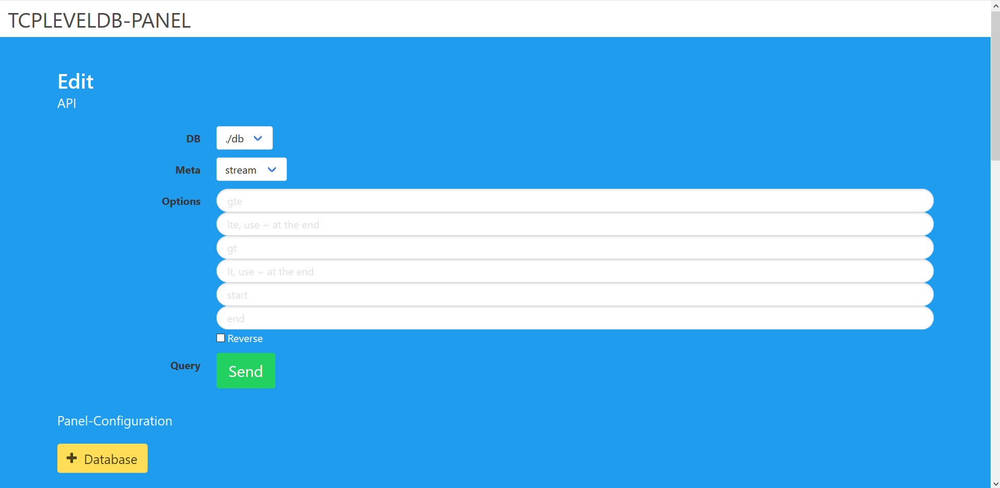

# tcpleveldb-panel

> A simple web-gui to query tcpleveldb-servers

## Download
```sh
git clone https://github.com/yamigr/tcpleveldb-panel.git
```
## Installing

Go to the folder and install the packages.
```sh
npm install
```
## Run the express-server
```sh
node webpanel 8081 localhost
```
Open your browser and hit {host}:{port}.

## GUI
> Notice: a tcpleveldb-server should run.If the connection not working, check the cli for error-messages.

Add a database at the Panel-Configuration. You can delete the database-config too. (this will only delete the configuration not the database)


Query the data with the tcpleveldb-API


Go to the results


## Authors

* **Yannick Grund** - *Initial work* - [yamigr](https://github.com/yamigr)

## ToDo

* Auth

## License

This project is licensed under the MIT License - see the [LICENSE.md](LICENSE.md) file for details

